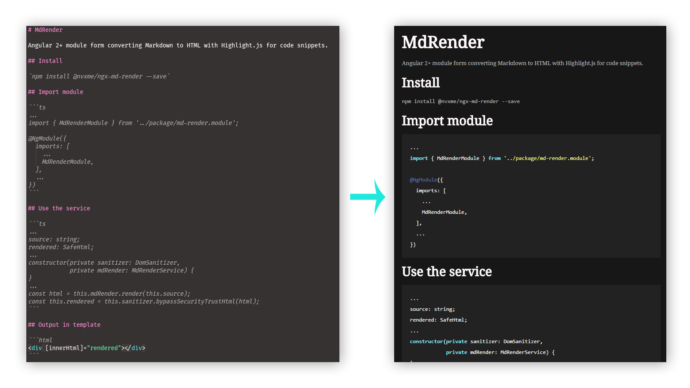

# MdRender

Angular 2+ module form converting Markdown to HTML with Highlight.js for code snippets.



## Install

`npm install @nvxme/ngx-md-render --save`

## Import module

```ts
...
import { MdRenderModule } from '@nvxme/ngx-md-render';

@NgModule({
  imports: [
    ...
    MdRenderModule,
  ],
  ...
})
```

## Use the service

```ts
...
source: string;
rendered: SafeHtml;
...
constructor(private sanitizer: DomSanitizer,
            private mdRender: MdRenderService) {
}
...
const html = this.mdRender.render(this.source);
const this.rendered = this.sanitizer.bypassSecurityTrustHtml(html);
```

## Output in template

```html
<div [innerHtml]="rendered"></div>
```

## Code styling

Import style in `.angular-cli.json`:

```
{
...
  "styles": [
    "styles.css",
    "../node_modules/highlight.js/styles/dracula.css"
  ],
```